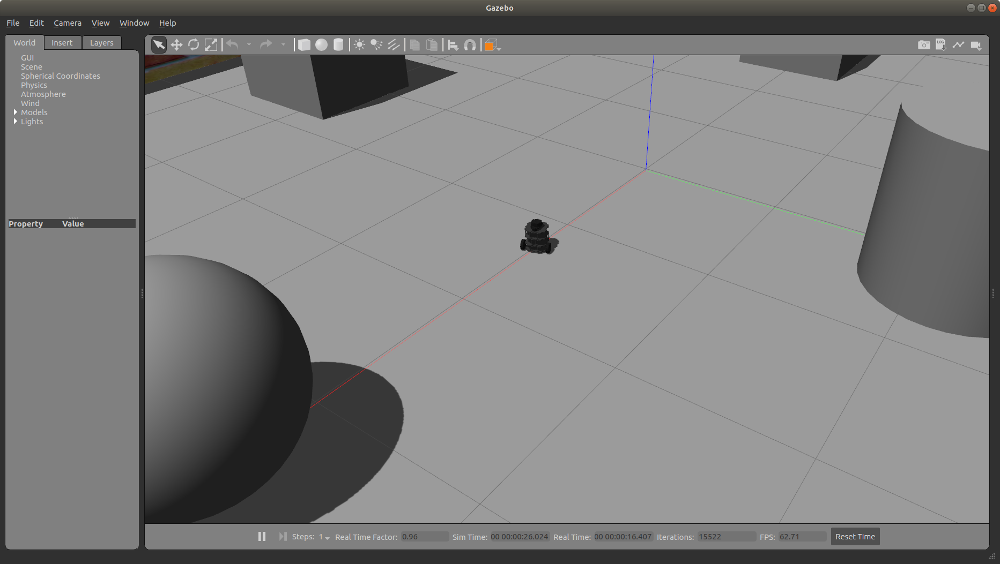

# Turtlebot simulation in Gazebo

 - Be sure to make changes to CMakeLists.txt and package.xml as needed.

## Author

Govind Ajith Kumar

## Overview

This code is a demo of turtlebot in a Gazebo world environment
 
## Assumptions
		ROS Melodic
		Ubuntu 18.04
		Turtlebot3 ros package is installed (Check below for installation guidelines)

## General structure of a catkin workspace

		workspace_folder/        -- WORKSPACE
		  src/                   -- SOURCE SPACE
		    CMakeLists.txt       -- 'Toplevel' CMake file, provided by catkin
		    package_1/
		      CMakeLists.txt     -- CMakeLists.txt file for package_1
		      package.xml        -- Package manifest for package_1
		    ...
		    package_n/
		      CMakeLists.txt     -- CMakeLists.txt file for package_n
		      package.xml        -- Package manifest for package_n

## Directory structure of this catkin_ws

		catkin_ws/
			build
			devel
			src
				turtlebot_tutorials
					CMakeLists.txt
					package.xml
				CMakeLists.txt

## To create the catkin package, building and sourcing it

		$ cd ~/catkin_ws/src
		$ catkin_create_pkg turtlebot_tutorials std_msgs rospy roscpp
		$ cd ..
		$ catkin_make
		$ . ~/catkin_ws/devel/setup.bash

## Creating a custom world

 - Use Gazebo's model editor and building editor to create a custom world file. 
 - Store this in a .world file format.
 - Find the world file in the worlds/ folder.
 - A snapshot of the world file can be seen here.

  

## Turtlebot3 Installation

 -  Ensure that the requirements for turtlebot3 is met. Install using the following command:
		$ sudo apt-get install ros-melodic-turtlebot3-*

 - Verify installation by launching the turtlebot in your custom world file.

## Turtlebot3 in the world

  

## Launch file
		
 - Add necessary lines to the launch file to spawn the custom world and a turtlebot in it

 - To launch the turtlebot and run the rosbag along with it as well execute the following command

		$ roslaunch turtlebot_tutorials turtlebot_tutorial.launch enable_ros_bag:=true

 - To launch the turtlebot and NOT run the rosbag along with it execute the following command

		$ roslaunch turtlebot_tutorials turtlebot_tutorial.launch

## Visualizing the rosbag

 - Without having Gazebo launched, start ros by typing the following in a terminal.
	
		$ roscore
 - Now start the bag.

 		$ rosbag play turtlebot_walker.bag

 - To visualize the rosbag at a later time in Gazebo, comment out the node launch from the launch file and execute the bag file (line number 30)
 - Now you have the Gazebo environment with the turtlebot open
 - The execution can be done with the following command;
		
		$ rosbag play turtlebot_walker.bag

## Running cpp-check

		$ cppcheck --enable=all --std=c++11 -I include/ test/ src/ --suppress=missingIncludeSystem $( find . -name *.cpp | grep -vE -e "^./build/" -e "^./vendor/" -e "^./src/")

## Running cpp-lint

		$ cpplint $( find . -name \*.hpp -or -name \*.cpp | grep -vE -e "^./build/" -e "^./vendor/" -e "^./docs/" -e "^./results" )

## Creating tags from the command line

Do the following steps to create a tag for your release

		$ git tag <tagname>
		$ git push origin --tags

